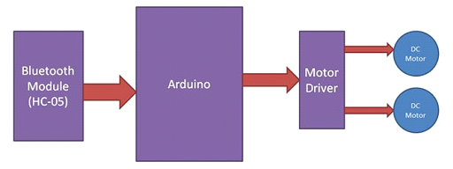
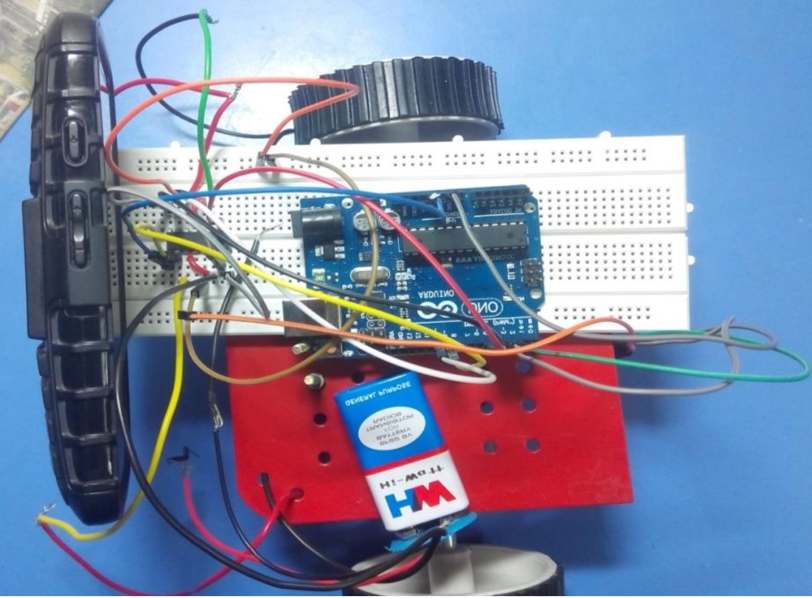

# Unmanned-Surveillience-Vehicle

An unmanned surveillance robot controlled via bluetooth through a mobile application. The main purpose of the robot is to roam around in a given environment while transmitting back real time data (video) to the ground station especially the places where humans can't enter due to lack of space, lack of convenience or security concerns. This real time data can then be used by the controller (human) to move the robot around.

## Block Diagram

## Prototype

